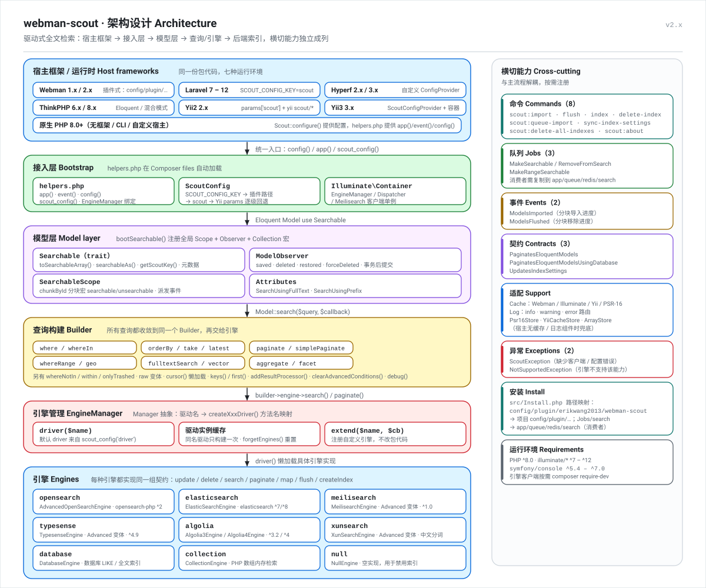
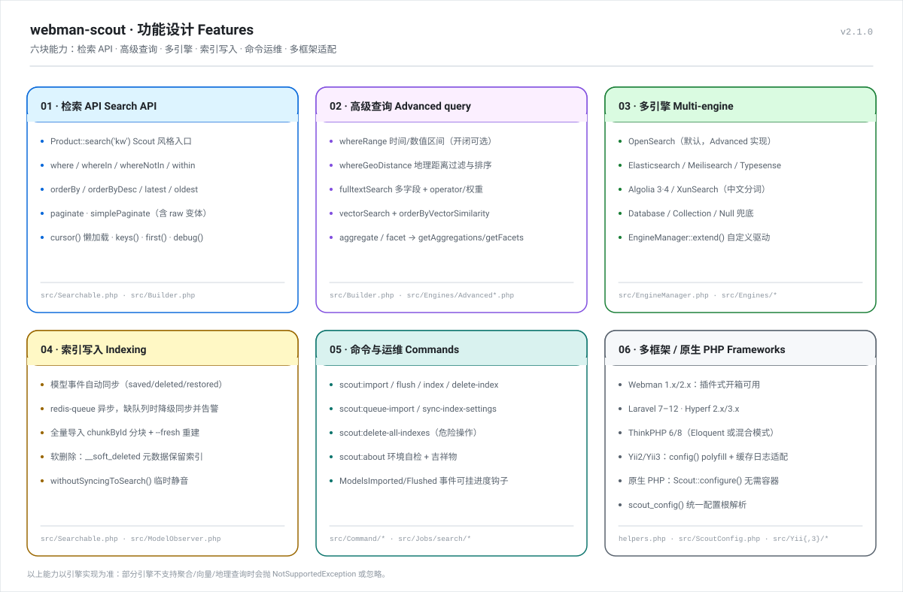
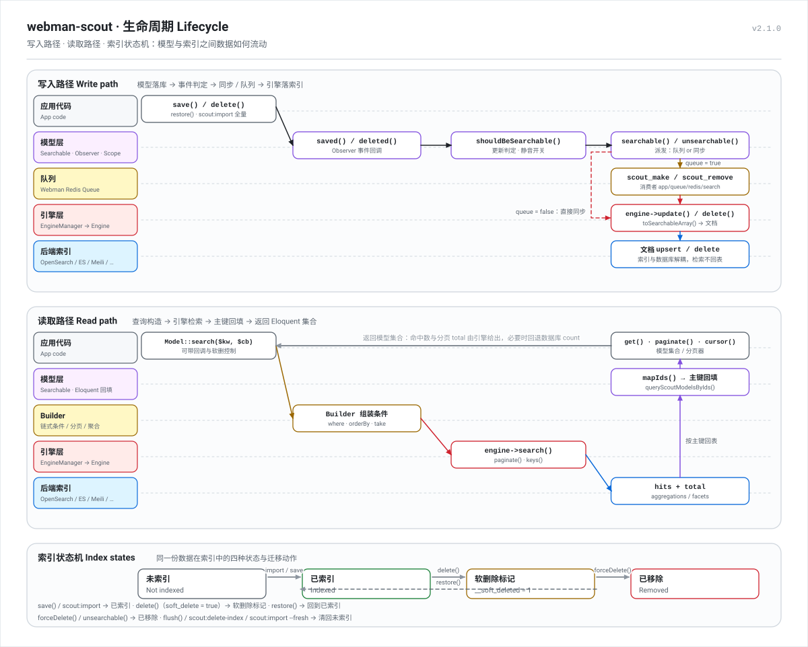

<!-- doc-nav：同步更新顶部导航与 `<details>`。左侧目录为 `position:fixed`；`doc-body` 用 `padding-left` 包住标题、简介与正文，避免被目录遮挡。github.com 可能去掉样式。 -->

<div style="position:fixed;left:12px;top:88px;width:min(288px,calc(100vw - 36px));max-height:min(520px,calc(100vh - 112px));overflow-y:auto;overflow-x:hidden;z-index:9998;padding:12px 14px;background:#f6f8fa;border:1px solid #d0d7de;border-radius:10px;font-size:12.5px;line-height:1.45;box-shadow:0 2px 14px rgba(31,35,40,.12)">

**顶部导航：** [顶部](#webman-scout) · [特性](#特性) · [项目结构](#项目结构) · [架构设计](#架构设计) · [功能设计](#功能设计) · [生命周期](#生命周期) · [框架与版本](#框架与版本) · [原生 PHP](#原生-php无框架) · [环境要求](#环境要求) · [安装](#安装) · [各框架使用说明](#各框架使用说明) · [配置项（节选）](#配置项节选) · [模型配置](#模型配置) · [基础使用](#基础使用) · [高级构建](#高级构建面向-opensearch--elasticsearch) · [Artisan / Webman 命令](#artisan--webman-命令) · [队列](#队列) · [构建器参考](#构建器参考扩展) · [项目宠物](#项目宠物) · [参考链接](#参考链接) · [许可证](#许可证)

<details open>
<summary><strong>左侧目录（大纲）</strong></summary>

- [特性](#特性)
- [项目结构](#项目结构)
- [架构设计](#架构设计)
- [功能设计](#功能设计)
- [生命周期](#生命周期)
  - [写入路径](#写入路径模型--索引)
  - [读取路径](#读取路径查询--索引--模型)
  - [索引状态](#索引状态)
- [框架与版本](#框架与版本)
- [环境要求](#环境要求)
- [安装](#安装)
  - [多框架配置根键](#多框架配置根键)
- [各框架使用说明](#各框架使用说明)
  - [Webman（1.x / 2.x）](#webman1x--2x)
  - [Laravel（7.x – 12.x）](#laravel7x--12x)
  - [Hyperf（2.x – 3.x）](#hyperf2x--3x)
  - [ThinkPHP（6.x / 8.x）](#thinkphp6x--8x)
  - [Yii2（2.x）](#yii2-2x)
  - [Yii3（3.x）](#yii3-3x)
  - [原生 PHP（无框架）](#原生-php无框架)
  - [对照简表](#对照简表)
- [配置项（节选）](#配置项节选)
  - [OpenSearch 配置示例](#opensearch-配置示例)
- [模型配置](#模型配置)
- [基础使用](#基础使用)
  - [搜索与索引](#搜索与索引)
  - [Laravel 7 兼容性说明](#laravel-7-兼容性说明)
- [高级构建（面向 OpenSearch / Elasticsearch）](#高级构建面向-opensearch--elasticsearch)
- [Artisan / Webman 命令](#artisan--webman-命令)
- [队列](#队列)
- [构建器参考（扩展）](#构建器参考扩展)
- [项目宠物](#项目宠物)
- [参考链接](#参考链接)
- [许可证](#许可证)

</details>

</div>

<a href="#webman-scout" title="返回顶部" aria-label="返回顶部" style="position:fixed;bottom:1.25rem;right:1.25rem;z-index:9999;padding:0.45rem 0.85rem;background:#0969da;color:#fff!important;border-radius:999px;font-weight:700;line-height:1;text-decoration:none;box-shadow:0 2px 12px rgba(31,35,40,.25)">↑</a>

<div style="padding-left:min(312px,max(8px,calc(100vw - 120px)));box-sizing:border-box;max-width:100%">

# webman-scout

<p align="center">
  
</p>

<p align="center">
  <sub><b>探探 · Sniffy</b> —— 侦察犬。嗅出文档、埋进索引、需要时再循迹找回。<br>
  在终端里打个招呼：<code>php webman scout:about</code> · <a href="#项目宠物">了解吉祥物</a></sub>
</p>

基于 [Laravel Scout](https://laravel.com/docs/scout) 并参考 [shopwwi/webman-scout](https://github.com/shopwwi/webman-scout) 的全文搜索扩展：一份代码同时支持 **六种框架 + 原生 PHP**（Webman · Laravel · Hyperf · ThinkPHP · Yii2 · Yii3 · 无框架）与 **九种引擎**（OpenSearch · Elasticsearch · Meilisearch · Typesense · Algolia · XunSearch · Database · Collection · Null），在兼容 Scout API 的基础上，补齐 **时间范围、地理距离、向量 / KNN 检索、聚合与分面**。

**默认文档语言为英文：** [README.md（English）](../../README.md)

因 shopwwi/webman-scout 更新停滞，为满足 **时间范围查询、数据聚合** 以及 **OpenSearch** 等需求，本包在相近 API 下增加了高级查询、聚合、分面、向量检索、地理距离等能力。

## 特性

- 与 Laravel Scout / shopwwi webman-scout 用法接近，便于迁移
- 引擎：**OpenSearch**、Elasticsearch、Meilisearch、Typesense、Algolia、XunSearch、Database、Collection、Null
- 默认面向 **OpenSearch**，支持复杂查询、聚合、KNN、地理检索
- 可跑在 Webman / Laravel / Hyperf / ThinkPHP / Yii2 / Yii3，**也可跑在原生 PHP**（[`Scout::configure()`](#原生-php无框架)，无需引导容器）
- 可选队列同步索引（Webman Redis Queue），缺队列时自动降级为同步并告警
- 索引设置同步、软删除、分块导入
- 设计文档与图示：[项目结构](#项目结构) · [架构设计](#架构设计) · [功能设计](#功能设计) · [生命周期](#生命周期)


## 项目结构

```text
webman-scout/
├── src/
│   ├── Searchable.php              # Eloquent trait：search()、searchable()、toSearchableArray()、元数据
│   ├── ModelObserver.php           # saved / deleted / restored / forceDeleted → 索引同步
│   ├── SearchableScope.php         # 基于 chunkById 的 searchable()/unsearchable() 宏 + 进度事件
│   ├── Builder.php                 # 链式查询构造：基础条件 + 高级条件 + 分页
│   ├── EngineManager.php           # 驱动解析（createXxxDriver）+ 实例缓存 + extend()
│   ├── Manager.php                 # 通用驱动管理器（driver()、forgetDrivers()、__call）
│   ├── Scout.php                   # VERSION + Scout::engine($name) + 原生 PHP 的 Scout::configure()
│   ├── ScoutConfig.php             # 跨框架配置根解析（SCOUT_CONFIG_KEY / 插件路径 / Yii params / 数组）
│   ├── Install.php                 # Webman 插件安装：复制配置与队列消费者
│   ├── XunSearchClient.php         # XunSearch（XS）连接封装
│   ├── Engines/                    # 16 个引擎实现，均继承 Engines\Engine
│   ├── Command/                    # 8 个 Symfony 命令（scout:import、scout:about 等）
│   ├── Jobs/search/                # Webman Redis Queue 消费者，复制到 app/queue/redis/search
│   ├── Support/                    # Cache / Log 适配：Webman、Illuminate、Yii、PSR-16/PSR-3 + ArrayStore 兜底
│   ├── Attributes/                 # #[SearchUsingFullText]、#[SearchUsingPrefix]
│   ├── Concerns/                   # 模型解析、分页状态恢复等
│   ├── Contracts/ Events/ Exceptions/
│   ├── Yii/                        # 命令桥（yii scout/*）
│   ├── Yii3/                       # ScoutConfigProvider 与配置接入
│   └── config/plugin/erikwang2013/webman-scout/
│       ├── app.php                 # 全部 Scout 配置（driver、prefix、queue、chunk、各引擎块）
│       ├── command.php             # Webman 命令注册
│       └── ini/                    # XunSearch ini 片段
├── tests/                          # PHPUnit 测试：引擎、命令、事件、队列、框架桩
├── helpers.php                     # app() / event() / config() / scout_config() 与容器绑定
└── docs/
    ├── images/                     # pet.svg + architecture.svg + features.svg + lifecycle.svg
    └── zh-CN/README.md             # 中文文档（本文件）
```

改动时可以从这里入手：

| 想做的事 | 从这里开始 |
|----------|------------|
| 查询 / 分页 | `Searchable::search()` → `src/Builder.php` |
| 增加查询能力 | `src/Builder.php` + 对应引擎的 `search()` |
| 增加搜索引擎 | `EngineManager::createXxxDriver()` + 继承 `Engines\Engine` |
| 改变索引写入时机 | `src/ModelObserver.php` |
| 改变配置解析规则 | `src/ScoutConfig.php` |
| 索引改成后台任务 | `src/Searchable.php`（`queueMakeSearchable`）+ `src/Jobs/search/` |
| 无框架下提供配置 | `Scout::configure()` → `src/ScoutConfig::setArraySource()` |
| 接入宿主日志 / 缓存 | `Support\Log::setLoggerResolver()` / `Support\Cache::setPsr16Resolver()` |


## 架构设计



真正干活的是三层，其余都是围绕它们的可插拔能力：

1. **接入层**：仅在宿主未提供时，`helpers.php` 定义 `app()`、`event()`、`config()`、`scout_config()`，并把 `EngineManager` 绑定到 Illuminate 容器。`ScoutConfig` 只解析一次配置根 —— `SCOUT_CONFIG_KEY` → Webman 插件路径 → `scout` → Yii `params` → 原生 PHP 用 `Scout::configure()` 注册的数组 —— 因此同一份代码可在各宿主运行。`app.php` 中统一使用 `getenv('KEY') ?: '默认值'`，不要写成双参数形式（第二参数是 `local_only` 布尔值）。
2. **模型层**：`use Searchable` 会注册三样东西：全局 Scope、`ModelObserver`、集合宏。观察者只负责**判断要不要写**，具体**怎么写**交给引擎；`SearchableScope` 用 `chunkById` 提供批量导入 / 移除宏并派发进度事件。
3. **查询与引擎层**：所有读取路径都收敛到同一个 `Builder`，再交给 `EngineManager::driver()`；每个引擎都实现同一组 `Engine` 契约（`update` / `delete` / `search` / `paginate` / `map` / `flush` / `createIndex`），因此**切换引擎不需要改动业务代码**。

横切能力不进入主流程：命令、队列任务、事件、契约、框架缓存 / 日志适配均按需注册（见图中右侧一列）。


## 功能设计



六块能力彼此独立：引擎只需实现基础契约，高级方法在不支持的引擎上会抛 `NotSupportedException` 或被忽略。实际使用时：

- **检索 API** 与 Scout 对齐，迁移基本只需 `use Searchable`；分页优先走引擎，引擎无法计数时回退数据库 count。
- **高级查询**（`whereRange`、`whereGeoDistance`、`fulltextSearch`、`vectorSearch`、`aggregate`、`facet`）以 OpenSearch / Elasticsearch 为第一优先，其余引擎按后端能力实现。
- **索引写入** 默认由模型观察者同步触发；开启队列后同样的调用会变成 `scout_make` / `scout_remove` 任务。未安装 `webman/redis-queue` 时会记录日志并降级为同步，而不是静默丢写。


## 生命周期



### 写入路径（模型 → 索引）

```
save()/delete()/restore()        模型上的单条写入
   └─ ModelObserver::saved()     批量导入走 SearchableScope::searchable()
        ├─ syncingDisabledFor()? withoutSyncingToSearch() → 跳过
        ├─ searchIndexShouldBeUpdated() / shouldBeSearchable() → 判断建索引还是移除
        └─ searchable() / unsearchable()
             ├─ queue = true  → Redis Queue scout_make / scout_remove（不可用则降级同步）
             └─ queue = false → syncMakeSearchable() → EngineManager::driver()->update($models)
                                                        └─ toSearchableArray() → 文档 upsert
```

### 读取路径（查询 → 索引 → 模型）

```
Model::search($query, $callback)   → Builder（where / orderBy / take / 高级条件）
   └─ engine->search($builder)      → 后端查询（hits + total + 聚合 / 分面）
        └─ mapIds()                 → 主键集合
             └─ queryScoutModelsByIds()  → Eloquent 回填（无 whereIntegerInRaw 时回退 whereIn）
                  └─ get() / paginate() / cursor()
```

索引里存的是文档而不是数据行：命中结果按主键回数据库取模型，因此 `total` 与分页在引擎无法提供时会回退为数据库 count。

### 索引状态

| 状态 | 含义 | 进入方式 |
|------|------|----------|
| 未索引 | 索引中没有该文档 | 初始状态 · `flush()` · `scout:delete-index` · `scout:import --fresh` |
| 已索引 | 文档存在 | `save()` · `scout:import` · `restore()` |
| 软删除标记 | `__soft_deleted = 1`，文档保留 | `soft_delete = true` 时的 `delete()` |
| 已移除 | 文档已删除 | `forceDelete()` · `unsearchable()` |


## 框架与版本

需要应用提供 **`config()`** 与 **`app()`（Illuminate 容器）**，模型为 **`Illuminate\Database\Eloquent\Model`**（或兼容实现，如 Hyperf Database Model）。Yii2 / Yii3 由本包自带 `config()` polyfill，因此同样只需要 Eloquent + Illuminate 容器。

| 框架 | 版本 | 说明 |
|------|------|------|
| **Webman** | 1.x / 2.x | 默认使用插件配置 `config/plugin/erikwang2013/webman-scout/`。 |
| **Laravel** | 7.x – 12.x | 将包内 `app.php` 配置数组放到 `config/scout.php`（或自建文件名），并设置环境变量 **`SCOUT_CONFIG_KEY=scout`**。需 **PHP ≥ 8.0**（Laravel 7 请使用支持 PHP 8 的 7.x 小版本）。 |
| **Hyperf** | 2.x – 3.x | 使用 Hyperf 配置与 DI；`Hyperf\Database\Model` 与 Eloquent 兼容。非插件路径下通过 **`SCOUT_CONFIG_KEY`** 指向你的配置根键。 |
| **ThinkPHP** | 6.x / 8.x | 适用于已集成 **Illuminate 配置 / 容器** 或使用 **`illuminate/database` Eloquent** 的项目。原生 **`think\Model`** 未接入本包 `Searchable` trait，需自行调引擎 API 或改用 Eloquent 模型承载索引数据。 |
| **Yii2** | 2.x | `config()` polyfill 读取 `Yii::$app->params['scout']`；缓存 / 日志自动走 `Yii::$app->cache` 与 `Yii::info\|warning\|error`；命令行桥 `yii scout/*`。 |
| **Yii3** | 3.x | `ScoutConfigProvider` 注入默认 `scout` 参数；PSR-16 缓存 + PSR-3 日志；在 `yiisoft/yii-console` 注册 Symfony 命令。 |
| **原生 PHP** | 8.0+ | 不需要框架与容器引导：`Scout::configure([...])`（或返回数组的文件路径）提供配置，`helpers.php` 提供 `app()` / `event()` / `config()`；Eloquent 自备引导（如 `Illuminate\Database\Capsule\Manager`）。见[原生 PHP（无框架）](#原生-php无框架)。 |

Composer 依赖 **`illuminate/*` ^7.0–^12.0**、**`symfony/console` ^5.4–^7.0**，与上述框架的传递依赖对齐。其中 **`illuminate/events` 是直接依赖**：模型观察者与导入进度事件都通过 `Illuminate\Events\Dispatcher` 派发。


## 环境要求

- PHP ^8.0
- Eloquent 模型（使用 `Searchable` trait 时）
- `illuminate/bus`、`contracts`、`database`、**`events`**、`http`、`pagination`、`queue`、`support`（版本随你的框架栈）
- 可选：`illuminate/log` / `illuminate/cache` / `psr/simple-cache` / `psr/log` —— 需要用宿主日志与缓存替代内置的 `error_log()` 与进程内数组缓存时安装


## 安装

```bash
composer require erikwang2013/webman-scout
```

Composer 的 **autoload `files`** 会加载 `helpers.php`：宿主没有时定义 `app()`、`event()`、`config()`（Yii2 / Yii3 / 原生 PHP）与 `scout_config()`，并把 `EngineManager` 绑定到容器。

安装后（Webman）执行插件安装，会复制配置与队列消费者：

- 配置目录：`config/plugin/erikwang2013/webman-scout/`
- 队列消费者：`app/queue/redis/search/`

### 多框架配置根键

包内所有业务配置通过 **`scout_config('键名')`** 读取。解析规则：

1. 若设置 **`SCOUT_CONFIG_KEY`**（例如 `scout`），则使用 `config('scout.xxx')`。
2. 否则若存在 `config('plugin.erikwang2013.webman-scout.app')`，使用 Webman 插件路径。
3. 否则尝试 `config('scout')` 或 `config('erikwang2013.webman-scout')`（需为含 `driver` / `prefix` 等字段的数组）。
4. Yii2 / Yii3 通过 `ScoutConfig::setSource()` 接入 `params['scout']`，无需设置环境变量。
5. 原生 PHP 用 **`Scout::configure($array)`**（或返回数组的文件路径）注册数组配置，配置根固定为 `scout`。

Laravel / Hyperf / ThinkPHP 非插件布局：请将 `src/config/plugin/erikwang2013/webman-scout/app.php` 的**返回数组**合并到你的配置文件，并设置 **`SCOUT_CONFIG_KEY=scout`**（与 `config/scout.php` 对应）。


## 各框架使用说明

以下默认已执行 `composer require erikwang2013/webman-scout`。

### Webman（1.x / 2.x）

1. **启用插件**：按 [Webman 插件文档](https://www.workerman.net/doc/webman/plugin.html) 安装/启用本插件，使 `config/plugin/erikwang2013/webman-scout/` 出现在项目中。若安装流程会执行包内 `Install`，会自动复制配置与队列消费者；否则可从 `vendor/erikwang2013/webman-scout/src/config/plugin/erikwang2013/webman-scout/` 手工拷贝。
2. **配置**：主配置为 `config/plugin/erikwang2013/webman-scout/app.php`。一般**不必**设置 `SCOUT_CONFIG_KEY`，`scout_config()` 会自动走插件路径。
3. **命令行**：通过 `config/plugin/erikwang2013/webman-scout/command.php` 注册，示例：`php webman scout:import "App\\Model\\Product"`（按实际命名空间修改）。
4. **模型**：通常继承 `support\Model`，并 `use Searchable`。
5. **队列（可选）**：安装 [webman/redis-queue](https://www.workerman.net/doc/webman/components/redis-queue.html)，在 Scout 配置中设 `'queue' => true`，并运行 `app/queue/redis/search/` 下消费者（如 `scout_make`、`scout_remove`）。未安装 Redis 队列或 `queue` 为 false 时，索引在**当前进程内同步**写入。

### Laravel（7.x – 12.x）

1. **配置文件**：新增 `config/scout.php`，`return` 与包内 `src/config/plugin/erikwang2013/webman-scout/app.php` **相同结构的数组**（`driver`、`prefix`、`opensearch` 等）。若同时使用官方 **`laravel/scout`**，注意避免配置键与启动流程冲突；本包可独立使用，不必再装官方 Scout。
2. **环境变量**：在 `.env` 中设置 **`SCOUT_CONFIG_KEY=scout`**，使 `scout_config('driver')` 对应 `config('scout.driver')`。
3. **容器**：`helpers.php` 会在 `app()` 上注册 `EngineManager`（及已安装时的 Meilisearch 客户端）。若你的应用在 Composer `files` 加载 `helpers` 之前尚未就绪，可在 `AppServiceProvider::register()` 中手动绑定：

   ```php
   $this->app->singleton(\Erikwang2013\WebmanScout\EngineManager::class, function ($app) {
       return new \Erikwang2013\WebmanScout\EngineManager($app);
   });
   ```

4. **Artisan 命令**：包内命令为 Symfony `Command`，名称如 `scout:import`。需向框架注册：
   - **Laravel 10 及以下**：在 `app/Console/Kernel.php` 的 `$commands` 中加入：

     ```php
     protected $commands = [
         \Erikwang2013\WebmanScout\Command\ImportCommand::class,
         \Erikwang2013\WebmanScout\Command\FlushCommand::class,
         \Erikwang2013\WebmanScout\Command\IndexCommand::class,
         \Erikwang2013\WebmanScout\Command\DeleteIndexCommand::class,
         \Erikwang2013\WebmanScout\Command\DeleteAllIndexesCommand::class,
         \Erikwang2013\WebmanScout\Command\QueueImportCommand::class,
         \Erikwang2013\WebmanScout\Command\SyncIndexSettingsCommand::class,
         \Erikwang2013\WebmanScout\Command\AboutCommand::class,
     ];
     ```

   - **Laravel 11+**：在 `bootstrap/app.php` 使用 `->withCommands([...])` 传入上述类名列表（参见 [Laravel 结构说明](https://laravel.com/docs/11.x/structure)）。

5. **模型**：继承 `Illuminate\Database\Eloquent\Model`（或项目基类）并 `use Searchable`。
6. **队列**：包内异步索引与 **`Webman\RedisQueue`** 集成；标准 Laravel 环境若无该类，请将配置中 **`queue` 设为 `false`** 使用同步索引，或自行在观察者/任务中调用引擎 `update()` 实现异步（可参考 `syncMakeSearchable` 逻辑）。

### Hyperf（2.x – 3.x）

1. **配置**：将 Scout 数组放到 Hyperf 配置中，例如 `config/autoload/scout.php`，内容与包内 `app.php` 一致。在 Hyperf 读取的环境变量中设置 **`SCOUT_CONFIG_KEY=scout`**，保证 `config('scout')` 为根配置。
2. **`config()` / `app()`**：需保证 `scout_config()` 最终能读到上述配置；若 `helpers.php` 中的 `app()` 与 Hyperf 容器不一致，请在 `ConfigProvider` 或 DI 配置中为 **`EngineManager`** 做显式绑定。
3. **模型**：`Hyperf\Database\Model` 与 Eloquent 兼容，在数据库组件配置正确的前提下可同样使用 `Searchable`。
4. **命令行**：将上述与 Laravel 相同的 Command 类注册到 [Hyperf 命令](https://hyperf.wiki/zh-cn/command.html)，或通过自定义入口挂载 Symfony Console。
5. **队列**：与 Laravel 相同，无 Webman Redis 队列时建议 **`queue` => false** 或自建异步任务。

### ThinkPHP（6.x / 8.x）

1. **适用范围**：`Searchable` 依赖 Eloquent 的观察者、集合等，**不能**直接挂在原生 `think\Model` 上。
2. **可用场景**：已使用 **`illuminate/database`** 与 Eloquent 模型，或中间层提供了 Laravel 风格 **`config()` + `app()` + Illuminate 容器** 时，可按 **Laravel** 小节配置 `config/scout.php`、`SCOUT_CONFIG_KEY` 与 `EngineManager`。
3. **纯 ThinkPHP 模型**：可解析 `app(EngineManager::class)->engine()` 后对文档数组调用 `update` / `delete` / `search`；或单独建一张表/模型用 Eloquent 仅做搜索同步。
4. **配置位置**：按 ThinkPHP 版本将 `scout` 数组写入 `config/scout.php` 等，并保证 `config('scout.xxx')` 可读。

### Yii2（2.x）

1. **配置**：把 Scout 数组放进 `config/params.php` 的 `'scout'` 键，键名与包内 `src/config/plugin/erikwang2013/webman-scout/app.php` 一致（直接复制即可）。`helpers.php` 提供的 `config()` polyfill 会用点号读取 `Yii::$app->params`，因此 `scout_config('driver')` 自动对应 `params['scout']['driver']`，**无需** `SCOUT_CONFIG_KEY`。
2. **模型**：使用真实的 Eloquent 模型（`Illuminate\Database\Eloquent\Model` + `use Searchable`），通过 `illuminate/database` 的 Capsule 引导；本包**不**依赖 `Yii::$app->db`。
3. **命令行**：在 `config/console.php` 注册命令桥：

   ```php
   'controllerMap' => [
       'scout' => \Erikwang2013\WebmanScout\Yii\ScoutController::class,
   ],
   ```

   随后可用 `yii scout/import "App\Models\Product"`、`yii scout/flush "App\Models\Product"`、`yii scout/index --name=posts [--key=id]`、`yii scout/delete-index --name=posts`、`yii scout/queue-import`、`yii scout/sync-index-settings [--driver=...]`、`yii scout/delete-all-indexes` 等；参数与 Symfony 选项一一对应，例如 `yii scout/import "App\Models\Product" --chunk=500 --fresh=1`。
4. **缓存 / 日志**：检测到 Yii2 时，`Support\Cache` / `Support\Log` 自动走 `Yii::$app->cache`（任意 `yii\caching\Cache` 组件）与 `Yii::info|warning|error`。
5. **队列**：与其他框架相同，保持 `'queue' => false`（同步）或自行实现异步任务。

### Yii3（3.x）

1. **配置插件**：在 `config-plugin.php` 注册：

   ```php
   'providers' => [
       // ...
       'erikwang2013/webman-scout' => [\Erikwang2013\WebmanScout\Yii3\ScoutConfigProvider::class],
   ],
   ```

   provider 会注入默认 `scout` 参数（即包内 webman 的 `app.php` 数组），并把配置 / 缓存 / 日志接到容器：`scout_config()` 读取合并后的 `params['scout']`，缓存使用 PSR-16 `CacheInterface`，日志使用 PSR-3 `LoggerInterface`。需要覆盖时，在应用 params 中自行设置 `'scout' => [...]`。
2. **命令行**：在 `params['yiisoft/yii-console']['commands']` 注册 Symfony 命令：

   ```php
   'yiisoft/yii-console' => [
       'commands' => [
           'scout:import' => \Erikwang2013\WebmanScout\Command\ImportCommand::class,
           'scout:queue-import' => \Erikwang2013\WebmanScout\Command\QueueImportCommand::class,
           'scout:index' => \Erikwang2013\WebmanScout\Command\IndexCommand::class,
           'scout:flush' => \Erikwang2013\WebmanScout\Command\FlushCommand::class,
           'scout:sync-index-settings' => \Erikwang2013\WebmanScout\Command\SyncIndexSettingsCommand::class,
           'scout:delete-index' => \Erikwang2013\WebmanScout\Command\DeleteIndexCommand::class,
           'scout:delete-all-indexes' => \Erikwang2013\WebmanScout\Command\DeleteAllIndexesCommand::class,
           'scout:about' => \Erikwang2013\WebmanScout\Command\AboutCommand::class,
       ],
   ],
   ```
3. **模型**：与 Yii2 相同 —— 通过 `illuminate/database` Capsule 使用 Eloquent 模型。
4. **队列**：与其他框架相同 —— `'queue' => false` 或自建异步任务。

### 原生 PHP（无框架）

完全不用框架 —— CLI 脚本、定时任务、队列消费者，或自建宿主。除本包自带的 `illuminate/*` 外，只需要自备 Eloquent 引导：`helpers.php` 已经提供 `app()`、`event()`、`config()`，无需再搭容器与配置仓库。

```php
require __DIR__.'/vendor/autoload.php';

use Erikwang2013\WebmanScout\Scout;
use Illuminate\Database\Capsule\Manager as Capsule;

// 1. Scout 配置：直接给数组，或给一个返回数组的 PHP 文件路径
Scout::configure([
    'driver' => 'opensearch',          // 也可用 database / collection / null
    'prefix' => 'app_',
    'queue' => false,                  // 没有 Webman Redis Queue，保持同步
    'opensearch' => [
        'host' => 'https://127.0.0.1:9200',
        'username' => 'admin',
        'password' => 'admin',
    ],
]);
// Scout::configure(__DIR__.'/scout.php');   // 从文件读取，等价
// Scout::configure($config, 'my-root');     // 换一个配置根键

// 2. Eloquent（模型、观察者、索引回填都依赖它）
$capsule = new Capsule;
$capsule->addConnection(['driver' => 'mysql', 'host' => '127.0.0.1', 'database' => 'app',
                         'username' => 'root', 'password' => '', 'charset' => 'utf8mb4']);
$capsule->setAsGlobal();
$capsule->bootEloquent();

// 3. 之后的使用与其他框架完全一致
$products = Product::search('手机')->where('status', 1)->paginate(15);
```

该路径下的行为：

- **配置**：`Scout::configure()` 会把配置根固定为 `scout`，`scout_config('driver')` 与 `config('scout.driver')` 都能读到；driver 缺失或为空时回退 `null` 引擎，而不是误打到其他服务。
- **日志**：没有日志组件时 `Support\Log` 写入 `error_log()`（前缀 `[webman-scout]`），不再抛异常；要接自己的 PSR-3：`Log::setLoggerResolver(fn () => $myLogger)`。
- **缓存**：没有缓存组件时 `Support\Cache` 退回进程内数组缓存（`Support\ArrayStore`）；要接 PSR-16：`Cache::setPsr16Resolver(fn () => $myPsr16)`。
- **证书路径**：`ssl_cert` / `ssl_key` 的相对路径优先按宿主的 `base_path()` 展开，宿主没有该函数时按当前工作目录展开。
- **队列**：保持 `'queue' => false`；缺少队列类时会自动跳过 Webman Redis Queue 并记录日志。
- **事件**：容器上已绑定 `Illuminate\Events\Dispatcher`，`ModelsImported` / `ModelsFlushed` 进度事件与 `scout:import` 命令都可用。

### 对照简表

| 步骤 | Webman | Laravel | Hyperf | ThinkPHP（Eloquent/混合） | Yii2 | Yii3 |
|------|--------|---------|--------|---------------------------|------|------|
| 配置文件 | `config/plugin/.../app.php` | `config/scout.php` | `config/autoload/scout.php` | `config/scout.php`（或版本对应路径） | `params['scout']` | `params['scout']`（provider 注入） |
| `SCOUT_CONFIG_KEY` | 一般不设 | `scout` | `scout` | 非插件路径时设 `scout` | 一般不设 | 一般不设 |
| 命令 | `php webman scout:*` | `php artisan scout:*`（需注册） | 按 Hyperf 注册 | 按项目控制台 | `yii scout/*`（controllerMap） | `yiisoft/yii-console` 注册 |
| 异步索引 | Redis Queue + 消费者 | `queue` 为 false 或自建 Job | 同左 | 同左 | 同左 | 同左 |


## 配置项（节选）

| 配置项 | 说明 |
|--------|------|
| `driver` | 默认引擎：`opensearch`、`elasticsearch`、`meilisearch`、`typesense`、`algolia`、`xunsearch`、`database`、`collection`、`null`。有高级变体的引擎可加 `advanced_` 前缀（`advanced_opensearch` 等同于 `opensearch`，后者本来就是高级实现；`advanced_elasticsearch` / `advanced_meilisearch` / `advanced_typesense` / `advanced_xunsearch` 提供聚合、分面、高亮与向量检索） |
| `prefix` | 索引前缀 |
| `queue` | 是否使用队列同步 |
| `chunk.searchable` / `chunk.unsearchable` | 批量分块大小 |
| `soft_delete` | 是否在索引中保留软删记录 |
| `after_commit` | 等事务提交后再写索引（需宿主注册数据库事务管理器） |

### OpenSearch 配置示例

```php
'opensearch' => [
    'host' => getenv('OPENSEARCH_HTTP_HOST') ?: 'https://127.0.0.1:6205',
    'username' => getenv('OPENSEARCH_USERNAME') ?: 'admin',
    'password' => getenv('OPENSEARCH_PASSWORD') ?: 'admin',
    'prefix' => getenv('OPENSEARCH_INDEX_PREFIX') ?: '',
    // 默认校验证书；字符串形式的 'false' / '0' 也能正确解析
    'ssl_verification' => filter_var(getenv('OPENSEARCH_SSL_VERIFICATION') ?: true, FILTER_VALIDATE_BOOLEAN),
    'indices' => [
        'products' => [
            'settings' => [ /* index settings */ ],
            'mappings' => [
                'properties' => [
                    'vector' => ['type' => 'knn_vector', 'dimension' => 1536],
                    'location' => ['type' => 'geo_point'],
                ],
            ],
        ],
    ],
],
```


## 模型配置

```php
use Erikwang2013\WebmanScout\Searchable;
use support\Model; // Webman；其他框架用你的 Eloquent 基类

class Product extends Model
{
    use Searchable;

    public function searchableAs(): string
    {
        return 'products';
    }

    public function toSearchableArray(): array
    {
        return [
            'id' => $this->id,
            'title' => $this->title,
            'content' => $this->content,
            'price' => $this->price,
            'created_at' => $this->created_at?->timestamp,
            'location' => ['lat' => $this->lat, 'lon' => $this->lng],
            'vector' => $this->embedding ?? [],
        ];
    }

    public function searchableFields(): array
    {
        return ['title', 'content'];
    }
}
```


## 基础使用

### 搜索与索引

```php
// 关键词搜索
$products = Product::search('手机')->get();

// 带回调，约束查询构造器
$products = Product::search('手机', function ($builder) {
    $builder->where('status', 1);
})->get();

// 分页
$paginator = Product::search('手机')->paginate(15);

Product::search('关键词')
    ->where('status', 1)
    ->whereIn('category_id', [1, 2, 3])
    ->orderBy('created_at', 'desc')
    ->take(20)
    ->get();

// 单条写入/移除索引（是否走队列取决于配置）
$product->searchableSync();
$product->searchable();
$product->unsearchable();

// 全量导入 / 清空该模型索引
Product::makeAllSearchable();
Product::removeAllFromSearch();

// 临时关闭同步
Product::withoutSyncingToSearch(function () {
    Product::query()->where('id', 1)->update(['title' => '新标题']);
});
```

### Laravel 7 兼容性说明

- 查询主键列表时，若当前 Eloquent 版本无 `whereIntegerInRaw`，会自动回退为 `whereIn`。
- `HasManyThrough::chunkById` 在较早版本不存在时，不会注册对应的 `searchable` / `unsearchable` 宏（关系批量导入需升级框架或使用普通查询构造器分块）。

## 高级构建（面向 OpenSearch / Elasticsearch）

以下链式方法主要面向 OpenSearch / Elasticsearch 等引擎（以实际引擎支持为准）。

```php
Product::search('')
    ->whereRange('created_at', ['gte' => 1609459200, 'lte' => 1640995200], true)
    ->whereRange('price', ['gte' => 100, 'lt' => 500])
    ->get();

Product::search('')
    ->whereGeoDistance('location', 31.23, 121.47, 10.0)
    ->get();

Product::search('')
    ->fulltextSearch('关键词', ['title', 'content'], ['operator' => 'and'])
    ->get();

Product::search('')
    ->orderByVectorSimilarity([0.1, -0.2 /* ... */], 'vector')
    ->get();

$builder = Product::search('关键词')
    ->aggregate('price_ranges', 'range', 'price', ['ranges' => [
        ['from' => 0, 'to' => 100],
        ['from' => 100, 'to' => 500],
    ]])
    ->facet('category_id', ['size' => 10]);

$results = $builder->get();
$aggregations = $builder->getAggregations();
$facets = $builder->getFacets();

// 引擎可按需切换：advanced_* 驱动解锁聚合 / 分面 / 高亮 / 向量
$engine = app(\Erikwang2013\WebmanScout\EngineManager::class)->engine('advanced_elasticsearch');
$engine->updateIndexMappings('products', [
    'properties' => [
        'new_field' => ['type' => 'keyword'],
    ],
]);

$builder = Product::search('关键词');
$builder->whereRange('created_at', $range)->get();
$builder->clearAdvancedConditions();
```

## Artisan / Webman 命令

**Webman** 下使用 `php webman …`。**Laravel** 需在项目中注册包内 Symfony 命令类后，再使用 `php artisan scout:import` 等（参见上文「各框架使用说明」中的 Laravel 小节）。

| 命令 | 说明 |
|------|------|
| `php webman scout:import [Model]` | 全量导入；支持 `--chunk`、`--fresh` |
| `php webman scout:flush [Model]` | 从索引中清空该模型数据 |
| `php webman scout:delete-index [Model]` | 删除该模型对应索引 |
| `php webman scout:index` | 列出/创建索引（依引擎实现） |
| `php webman scout:queue-import` | 通过队列导入 |
| `php webman scout:sync-index-settings` | 同步索引设置 |
| `php webman scout:delete-all-indexes` | 删除所有托管索引（慎用） |
| `php webman scout:about` | 吉祥物 + 当前配置 + 引擎可用性自检 |

具体参数以各命令 `--help` 为准。

## 队列

在配置中开启 `queue` 后，模型的 `searchable()` / `unsearchable()` 在存在 `Webman\RedisQueue\Redis` 时会进入 Redis 队列；请保证 `app/queue/redis/search` 下消费者已运行（如 `scout_make`、`scout_remove`）。未使用 Webman Redis 队列时，请将配置中 **`queue` 设为 `false`** 或自行实现异步任务。

> 消费者类位于包内 `src/Jobs/search/`，但必须**复制到你的项目** `app/queue/redis/search/` —— 其命名空间 `app\queue\redis\search` 与项目相关，无法从 `vendor/` 自动加载。插件安装器会自动完成；手工安装请复制 `src/Jobs/search/MakeSearchable.php` 与 `RemoveFromSearch.php`。

## 构建器参考（扩展）

| 方法 | 说明 |
|------|------|
| `whereRange($field, array $range, bool $inclusive = true)` | 范围过滤 |
| `whereGeoDistance($field, $lat, $lng, $radius)` | 地理距离 |
| `fulltextSearch($query, array $fields = [], array $options = [])` | 全文检索 |
| `orderByVectorSimilarity(array $vector, ?string $vectorField = null)` | 向量排序 |
| `aggregate(...)` / `facet(...)` | 聚合 / 分面 |
| `addResultProcessor(callable $processor)` | 结果后处理 |
| `getAggregations()` / `getFacets()` | 读取聚合与分面结果 |
| `clearAdvancedConditions()` | 清空高级条件 |

OpenSearch 等引擎通常还提供 `updateIndexMappings(string $index, array $mappings)` 用于更新映射。

## 项目宠物

**探探（Sniffy）** 是本项目的吉祥物：一只拿着放大镜的侦察犬 —— 嗅出文档、埋进索引、需要时再循迹找回。矢量图在 [`docs/images/pet.svg`](../images/pet.svg)，同时也是[架构设计](#架构设计)、[功能设计](#功能设计)、[生命周期](#生命周期) 三张图的视觉基准。

它已经接进包内，做成了控制台命令，顺带充当环境自检：

```bash
php webman scout:about      # Laravel 下为 php artisan scout:about
```

```
   __        __      ___
  /  \______/  \    /   \
  |            |   | --  |
  |   o    o   |    \   /
  |     __     |       |
  \    \__/    /       |
   \__________/

  Scout · webman-scout v2.1.0  sniff out your data · 嗅出你的数据

  config root 配置根        plugin.erikwang2013.webman-scout.app
  driver 引擎               opensearch
  prefix 索引前缀           app_
  queue 队列                off（请求内同步索引）
  soft delete 软删除        on（保留 __soft_deleted 文档）
  after commit 事务后提交   off
  chunk 分块                searchable=500 / unsearchable=500

  engines 引擎可用性 （composer require 对应客户端后即可用）
  algolia        ✘  collection     ✔  database       ✔
  elasticsearch  ✘  meilisearch    ✔  null           ✔
  opensearch     ✔  typesense      ✔  xunsearch      ✘
```

实现位于 [`src/Command/AboutCommand.php`](../../src/Command/AboutCommand.php)（吉祥物字符画 + 引擎可用性探测）。

## 参考链接

- [Laravel Scout 文档](https://laravel.com/docs/scout)
- [shopwwi/webman-scout](https://github.com/shopwwi/webman-scout)


## 开源不易，欢迎支持 / Support this project

| WeChat Pay 微信 | Alipay 支付宝 |
|:---:|:---:|
|  |  |

感谢支持！Thank you for your support!

## 许可证

MIT

---

© erik <erik@erik.xyz> · https://erik.xyz

</div>
